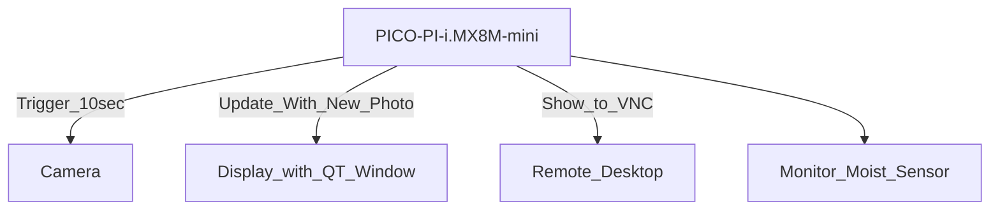

# ProyectoIoT

SavingImages is a file that read the camera frame and save a picture every 10 seconds.
QT project is the GUI that shows the image taken by the camera.

The project consists on monitoring a plant when this is not too accessible or the owner is away from this plant and needs to care of that.
The idea is to take these pictures to the plant to see the status of this one, measure and know the moisture around it and see the growth of this one.

It was pretended to transmit the image visualization (display window) through a VNC for monitoring and see if the plant needs water or it is getting infected by some plague to request help from a family member or owner's friend. But VNC connection could not be solved but other parts of the project were successful.

The general scheme/diagram of the functionality and connections from this project is as following:

